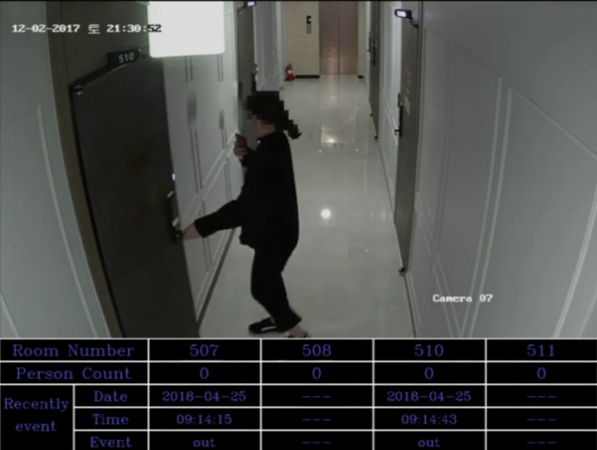
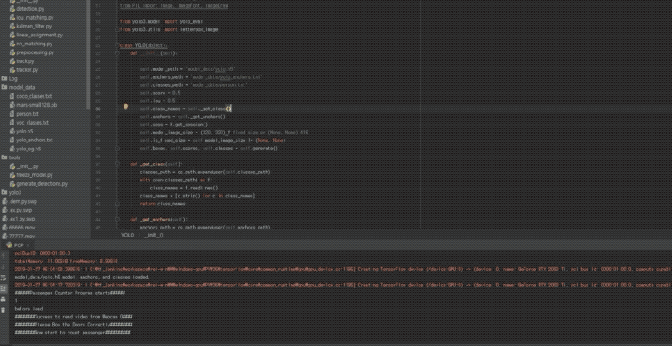

PersonCounter
===

## About PersonCounter
This program counts entry/exit of person. The detection of person is based on deep learning method. Extended Kalman Filter is used to tracking, and self-implemented codes to count entry/exit. Finally, sends the data to the API server.

## Importance
It can count all the people who enter/exit pre-arranged area. The final goal of this project is to integrate it with CCTV server to inform supervisors how many people are staying in the rooms, or have entry/exit some areas. For example, it will be really helpful for fully-automated hotels (자동 호텔, 무인텔).
 
 - The stage of this project  
    - [ ] Foster Ideas
    - [ ] Focus Ideas
    - [ ] Develop Ideas
    - [X] Prototypes and Trials
    - [ ] Product Development Activities
    - [ ] Launch
    
 - Goal
    - The final goal of this project
        - Auto Person Counter development ([TRL](https://itec.etri.re.kr/itec/sub01/sub01_07.do) : 3 ~ 5)
        - Integrate with CCTV server to count entry/exit. 
        - Display the result on web or mobile applications.
        
 - Keywords
    - Object Detection
    - Deep Learning
    - Extended Kalman Filter
    - Tracking
    - Computer Vision
    - API Integration
  
- Environment
    - _SOFTWARE_
      - Python 3.6
      - CUDA 9.0
      - CuDNN 7.0.5
      - tensorflow-gpu 1.5.0
      - OpenCV 3.4.3.18
      - keras
      - pillow, sklearn etc...
      - Ubuntu 16.04 LTS, Window 10
    - _HARDWARE_
      - Any PC contains GPU supports CUDA 9.0

## Result
### Single camera
The video source can be IP camera, webcam and etc... With RTX 2080Ti, the original frame rate of entire program (with showing the images, by cv2.imshow()) was 12 fps.

__I had updated my custom model to detect person. With RTX 2080Ti, the frame rate of entire program  is 20 fps.__

### Multiple camera
It supports multiple cameras by multi processing. With RTX 2080Ti, it can run up to 16 video sources.

## Source Code
The entire project is funded by Oasys Story. The source code coult not be open.  __The all copyrights are reserved to Oasys Story (2019).__
<http://www.oasyss.co.kr>
